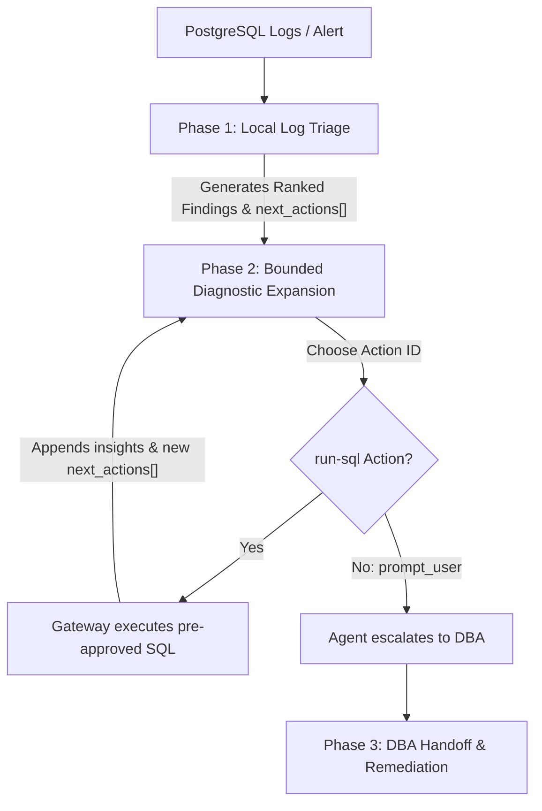

# The Runbook Model

`pg-logstats` is not a SQL shell or a command runner for AI agents. Instead, it is a secure, runbook-driven triage gateway. 

As a Database Administrator (DBA), granting autonomous agents direct or arbitrary access to your PostgreSQL instance carries high operational and security risks. `pg-logstats` solves this by restricting agents to executing structured, pre-defined operational runbooks.

---

## Runbook Structure & Division of Labor

The core philosophy of `pg-logstats` is a clean separation between **runbook structure** and **agent judgement**:

* **The Gateway Enforces the Runbook**: `pg-logstats` defines the diagnostic evidence model, the log-parsing logic, the allowed database queries, and the safety policies.
* **The Agent Supplies the Judgement**: The agent acts as a navigator. It reads the gateway's structured findings and decides which branch of the runbook to pursue next based on the incident context.

This design prevents agents from inventing raw database queries, running arbitrary commands, or degrading database performance during an active incident.

---

## The Runbook Execution Loop

When an incident occurs, the agent executes a structured runbook in three distinct phases:

### Phase 1: Local Log Triage
The agent initiates triage offline by analyzing a database log source. The gateway parses these logs, normalizes the queries, groups related events, and generates a structured report containing ranked findings. 

### Phase 2: Bounded Diagnostic Expansion
To help the agent investigate further, the gateway attaches a list of pre-approved, context-specific diagnostic SQL actions (`next_actions[]`) directly to the findings.
* If the agent wants to inspect lock waits or check query plans, it must select a specific, pre-defined `action_id`.
* The agent executes the action by invoking the gateway's `run-sql` interface. The gateway validates the action, binds any required parameters (like a query ID or application name), and executes its own built-in query. The agent has no way to supply raw SQL text.

### Phase 3: DBA Handoff & Remediation
When the diagnostic path is exhausted or requires human intervention (such as modifying schema or adjusting global parameters), the agent stops. It hands off the investigation to the DBA, providing structured, granular recommendations (like creating specific indexes or adjusting session memory).

---

## Safety & Database Protection Guardrails

To protect your production database from runaway agent queries, the gateway enforces three key guardrails:

1. **Strict Parameter Binding**: Pre-approved diagnostic actions only accept specific identifiers (e.g., `queryid` or `application_name`). Raw SQL execution is impossible.
2. **Active Load Shedding (The Safety Verdict)**: Running diagnostic queries—especially `EXPLAIN ANALYZE`, which actually executes the query—can add harmful overhead to a stressed database. The gateway evaluates database health (e.g., active session counts and wait events) to determine a health **verdict** (`clear`, `busy`, or `saturated`). Bounded-risk actions are automatically blocked if the database is under load.
3. **Immutable Audit Trail**: The gateway persists every triage step and follow-up query as an immutable JSON report under the workspace directory. This provides the DBA with a complete, tamper-proof audit trail of the agent's actions during the incident.

---

## Read Next

* [Investigation Guidance & Safety Policies](action-types.md)
* [Slow Query Triage Runbook](../user-guide/top-query-families.md)
* [Temporary Files Triage Runbook](../user-guide/temp-files.md)
