# Temporary Files Triage Runbook

This page defines the temporary files triage runbook that `pg-logstats` enables for AI agents. 

As a Database Administrator (DBA), you configure and monitor `pg-logstats` as a secure gateway. This document outlines how agents execute this specific runbook, the diagnostic evidence they gather, the safety policies enforced, and the structured recommendations they hand off to you.

---

## The Agent Triage Runbook

When database alerts or query latency logs indicate disk pressure from temporary files, the agent automates a three-phase runbook to safely isolate and diagnose the root cause:

```mermaid
sequenceDiagram
    participant Agent as AI Agent (pg-logstats)
    participant Logs as PostgreSQL Logs
    participant DB as Live Database (SQL)
    participant DBA as Database Administrator (DBA)
    
    rect rgb(20, 20, 30)
        Note over Agent, Logs: Phase 1: Offline Correlation & Attribution
        Agent->>Logs: Parse temp file events & correlate via PID
        Logs-->>Agent: Returns correlated Query Family & SQL statement
    end
    
    rect rgb(30, 20, 20)
        Note over Agent, DB: Phase 2 & 3: Live Verification & Deep-Dive
        Agent->>DB: Query database counters & temp block activity
        DB-->>Agent: Confirms database-wide disk write pressure
        Agent->>DB: Run EXPLAIN / EXPLAIN ANALYZE on query family
        DB-->>Agent: Returns query execution plan (with buffer statistics)
    end
    
    rect rgb(20, 30, 20)
        Note over Agent, DBA: Phase 4: Structured Remedial Handoff
        Agent->>Agent: Derive plan insights (disk spill / temp buffers)
        Agent->>DBA: Suggest granular fixes (index sort, reduce width, local work_mem)
    end
```

### Phase 1: Offline Correlation & Attribution (Log-Backed)
PostgreSQL logs temporary file creation on a separate line (e.g., `LOG: temporary file: path "...", size ... bytes`) which does not contain the query text. 
* **PID Correlation**: The agent matches the database process ID (PID) of the temp file event and searches nearby log events to attribute the disk pressure to a specific query statement.
* **Query Family Mapping**: The matched query is normalized into a stable `query_family_id` so the agent can rank and track database-wide temp file volume by pattern.

### Phase 2: Live Statistics Verification
If the database connection is available (`log_backed_and_live` mode), the agent queries system views to verify if the disk spill is an ongoing or database-wide concern:
* `temp_file.pg_stat_database.temp_counters`: Verifies database-level cumulative temp file statistics in `pg_stat_database`.
* `temp_file.pg_stat_statements.temp_blocks`: Queries `pg_stat_statements` to identify the heaviest queries writing temporary blocks.

### Phase 3: Deep-Dive Plan Verification (EXPLAIN / EXPLAIN ANALYZE)
The agent runs query plan verification next:
* **EXPLAIN** (`temp_file.explain`): Safely retrieves the execution plan without running the query to verify if the planner anticipates a sort or hash spill.
* **EXPLAIN ANALYZE** (`temp_file.explain_analyze`): Runs the query with buffer statistics to verify actual temp buffers written under execution.

---

## Derived Insights

When the agent receives the query plan from a `run_sql` action, it parses the execution plan text and extracts one of the following structured insights:

* **`query_plan_disk_spill_detected` (High Confidence)**: 
  Parsed from lines containing `external merge` or `Disk: <size>`. It confirms that the planner had to spill pages to disk during sorting or hashing.
* **`explain_analyze_temp_buffers` (High Confidence)**: 
  Parsed from buffer lines containing `temp read=<N> temp written=<M>`. It confirms that temporary buffers were read/written to disk during execution.
* **`query_plan_no_disk_spill` (Medium Confidence)**: 
  Emitted when a plan is successfully retrieved but shows no disk spill. This tells the agent that the query parameters or current database size do not trigger a disk sort in this specific state/environment.

---

## Agent-Suggested DBA Remedial Actions

Once the agent completes the diagnostic loop and confirms a temp file issue, it terminates its live exploration branch and hands off three distinct, granular remedial actions to the DBA:

### 1. Create B-Tree Index
* **Action ID**: `remedial.create_sort_index`
* **Label**: `DBA Recommendation: Create B-Tree index on sort/group columns`
* **Runbook**: The agent advises creating a B-Tree index on the sorting (`ORDER BY`) or grouping (`GROUP BY`) columns. This allows PostgreSQL to scan the index in-order, completely avoiding the dynamic sort node and reducing temp file writes to **0 bytes**.

### 2. Select Fewer Columns
* **Action ID**: `remedial.reduce_projection_width`
* **Label**: `Developer Recommendation: Select fewer columns to narrow row width`
* **Runbook**: The agent advises developers to avoid `SELECT *` and retrieve only the exact columns needed. Sorting narrow rows requires significantly less memory, which helps the sort fit entirely within the session's memory buffer.

### 3. Adjust Session `work_mem` Locally
* **Action ID**: `remedial.optimize_work_mem`
* **Label**: `DBA Recommendation: Adjust session work_mem locally`
* **Runbook**: The agent advises setting a local, session-level memory override (e.g. `SET LOCAL work_mem = '64MB';`) *before* executing this specific query, rather than raising the global `work_mem` parameter (which increases risk of memory saturation/OOMs under high concurrency).

---

## Safety & Audit Policies

> [!IMPORTANT]
> The agent is restricted by a strict safety policy enforced at the gateway layer. The agent **cannot** run arbitrary SQL or modify schema/data.

### Risk & Verdict Restrictions
* **No Arbitrary SQL**: The agent can only request queries by selecting a structured `action_id`.
* **Risk Classifications**:
  * Standard `EXPLAIN` (`ExplainWithoutAnalyze` class) is classified as `Safe` and is allowed.
  * `EXPLAIN (ANALYZE, BUFFERS)` (`ExplainAnalyze` class) actually runs the query, carrying a risk of side-effects or heavy database load. It is classified as `Bounded` risk and is blocked by default under restrictive health verdicts (`Verdict::Clear` blocks it by default to avoid unintended system load).
