# Slow Query Triage Runbook

This page defines the slow query triage runbook that `pg-logstats` enables for humans and AI agents.

Use this workflow when PostgreSQL logs show slow statements, latency alerts, or query duration spikes. The first pass is offline and log-backed: `pg-logstats` ranks query families by total runtime, call count, and latency. If live database access is configured and `inspect` reports `log_backed_and_live`, the report can include bounded follow-up actions for current sessions or execution plans.

---

## The Agent Triage Runbook

When query latency alerts trigger, the runbook identifies bottleneck queries first, then optionally expands into live session and plan checks:

```mermaid
sequenceDiagram
    participant Agent as AI Agent (pg-logstats)
    participant Logs as PostgreSQL Logs
    participant DB as Live Database (SQL)
    participant DBA as Database Administrator (DBA)
    
    rect rgb(20, 20, 30)
        Note over Agent, Logs: Phase 1: Offline Ranking & Attribution
        Agent->>Logs: Parse statement durations & rank Query Families
        Logs-->>Agent: Returns ranked queries & metadata (DB, user, app)
    end
    
    rect rgb(30, 20, 20)
        Note over Agent, DB: Optional Live Follow-Up
        Agent->>DB: Query pg_stat_activity by DB, user, app dimensions
        DB-->>Agent: Returns active sessions (e.g. locks, wait states)
        Agent->>DB: Run EXPLAIN / EXPLAIN ANALYZE on query family
        DB-->>Agent: Returns plan structure (Seq Scan, Sort Method, etc.)
    end
    
    rect rgb(20, 30, 20)
        Note over Agent, DBA: Structured Remedial Handoff
        Agent->>Agent: Derive session & plan insights
        Agent->>DBA: Recommend granular fixes (create index, select columns, local work_mem)
    end
```

### Phase 1: Offline Ranking & Attribution (Log-Backed)
The agent begins by scanning the historical log window to isolate resource hogs:
* **Duration Parsing**: Parses statement lines and matches them with their corresponding duration logs (e.g., `LOG: duration: ... ms`).
* **Query Family Grouping**: Normalizes literals and whitespace to group query patterns into stable `query_family_id` targets.
* **Outlier Ranking**: Ranks query families by total execution time, p95 latency, and call frequency to pinpoint the bottleneck.

### Phase 2: Optional Live Session Correlation
If live access is configured (`log_backed_and_live` mode), the agent correlates log findings with the current database state:
* `query_family.pg_stat_activity.by_dimensions`: Queries `pg_stat_activity` for active backends that match the target database, user, application name, or query pattern.
* **Concurrency Check**: Identifies whether the slow query is an isolated incident or part of a concurrent bottleneck causing queueing.

### Phase 3: Optional Execution Plan Deep-Dive (EXPLAIN / EXPLAIN ANALYZE)
The agent runs query plan verification to locate inefficient scan nodes or spills:
* **EXPLAIN** (`query_family.explain`): Safely retrieves the execution plan without running the query to check for sequential scans or bad joins.
* **EXPLAIN ANALYZE** (`query_family.explain_analyze`): Executes the query with buffer statistics to verify actual read/write counts and plan node durations.

---

## Derived Insights

Based on live SQL actions, the agent automatically interprets raw session rows and plan lines to yield stable insights:

### Session & Blocking Insights (`pg_stat_activity`)
* **`active_session_present`**: At least one backend is currently executing the target query pattern.
* **`multiple_active_sessions`**: Multiple concurrent backends are executing the target query, indicating concurrency pressure.
* **`transactionid_lock_wait`**: The backend is active but blocked waiting on a transaction-level lock (e.g. row lock contention).
* **`no_live_match_found`**: No active sessions match the dimensions, indicating the issue was historical or transient.

### Execution Plan Insights (`EXPLAIN`)
* **`query_plan_disk_spill_detected`**: The query execution plan confirms a sort or hash operation spilled to disk (e.g., external merge sort).
* **`explain_analyze_temp_buffers`**: Buffer statistics confirm temporary buffers were read/written during execution.
* **`query_plan_no_disk_spill`**: The plan returned successfully but shows no spill, indicating the current parameters or table sizes do not trigger disk sorts.

---

## Agent-Suggested DBA Remedial Actions

Once the agent completes the available diagnostic path, it stops exploration and hands off structured remedial actions to the DBA:

### 1. Create B-Tree Index
* **Action ID**: `remedial.create_sort_index`
* **Label**: `DBA Recommendation: Create B-Tree index on sort/group columns`
* **Runbook**: The agent advises creating a B-Tree index on columns used in `WHERE` filters, `JOIN` conditions, or `ORDER BY` clauses to eliminate sequential scans or dynamic disk sorting.

### 2. Select Fewer Columns
* **Action ID**: `remedial.reduce_projection_width`
* **Label**: `Developer Recommendation: Select fewer columns to narrow row width`
* **Runbook**: The agent advises developers to avoid `SELECT *` and select only the exact columns required, reducing row width and the memory footprint of sort and join buffers.

### 3. Adjust Session `work_mem` Locally
* **Action ID**: `remedial.optimize_work_mem`
* **Label**: `DBA Recommendation: Adjust session work_mem locally`
* **Runbook**: The agent advises setting a local, session-level memory override (e.g. `SET LOCAL work_mem = '64MB';`) *before* executing the target query, rather than raising the global parameter (which risks memory saturation under concurrency).

---

## Safety & Audit Policies

> [!IMPORTANT]
> The agent is restricted by a strict safety policy enforced at the gateway layer. The agent **cannot** run arbitrary SQL or modify schema/data.

### Risk & Verdict Restrictions
* **No Arbitrary SQL**: The agent can only request queries by selecting a structured `action_id`.
* **Risk Classifications**:
  * Standard `EXPLAIN` (`ExplainWithoutAnalyze` class) is classified as `Safe` and is allowed.
  * `EXPLAIN (ANALYZE, BUFFERS)` (`ExplainAnalyze` class) actually runs the query, carrying a risk of side-effects or heavy database load. It is classified as `Bounded` risk and is blocked whenever the safety verdict or configuration does not permit that action class.
